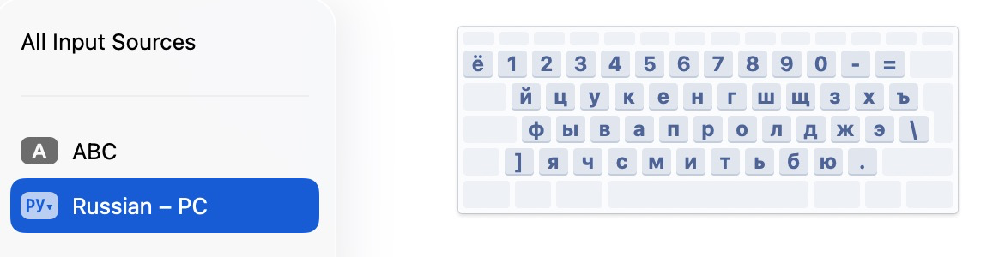
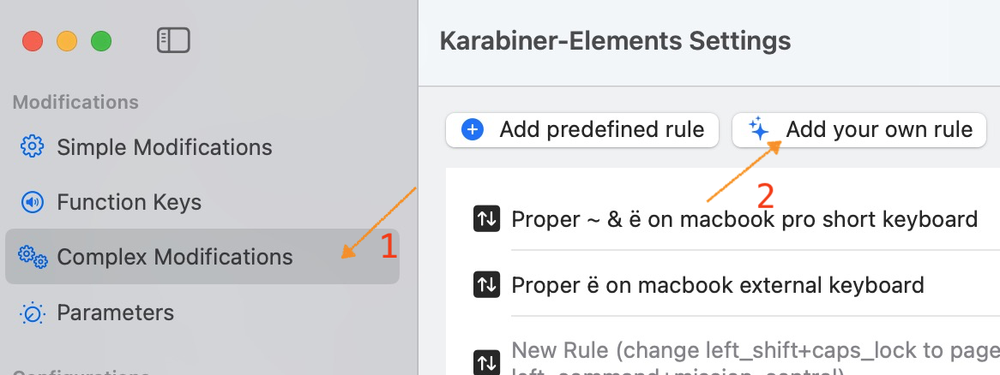

# Зачем это нужно?
Если у вас различные клавиатуры под Mac, например, встроенная с macbook 14" без "~", внешняя на 104 клавиши, и вы используете Russian PC (чтобы была ПК-совместимая раскладка), то начинается боль с различными клавишами.

Пример моих раскладок:



В моём примере всё сложно с тильдой (~), вместо неё имеем § и ±.

# Решение
Я использую [Karabiner-elements](https://karabiner-elements.pqrs.org/) и написал несколько правил, файлики `*.json` в этом каталоге.

Ставим karabiner-elements, далее импортируем мои JSON:



# Как это работает?
Одно правило чинит проблемы с внешней клавиатурой Apple 104 клавиши (определяется через product_id и vendor_id, см. `karabiner-eventviewer`):
```json
    "identifiers": [
        {
            "product_id": 620,
            "vendor_id": 76
        }
    ],
    "type": "device_if"
```

Второе чинит встроенную клавиатуру, определяет через:
```json
    "type": "device_if",
    "identifiers": [
    {
        "is_built_in_keyboard": true
    }
    ]
```